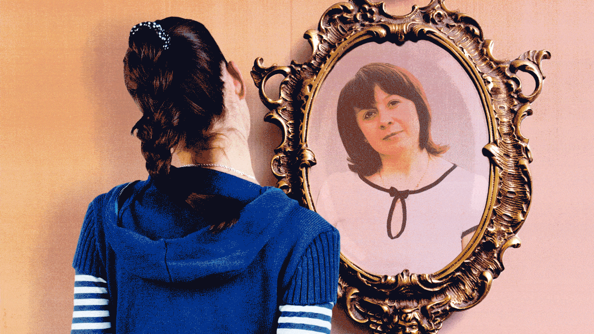
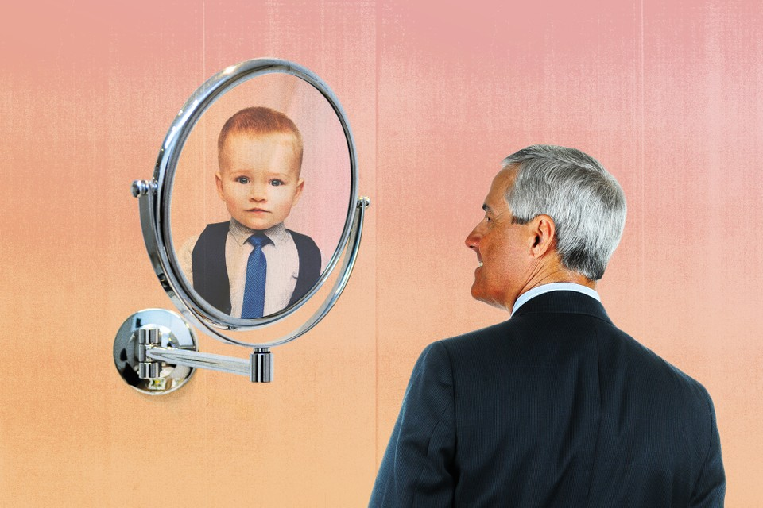
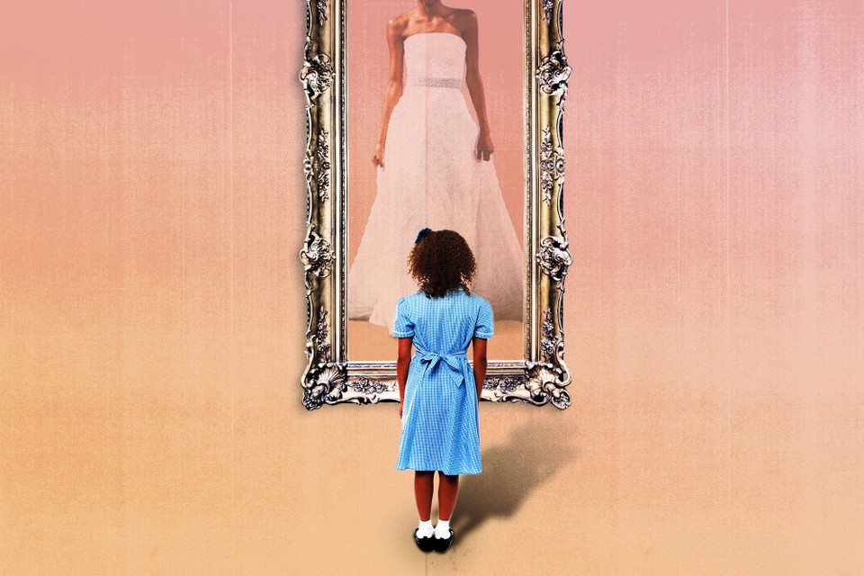

# When Are You Really an Adult?

By Julie Beck

January 5, 2016

In an age when the line between childhood and adulthood is blurrier than ever, what is it that makes people grown up?

It would probably be fair to call Henry "aimless." After he graduated from Harvard, he moved back in with his parents, a boomerang kid straight out of a trend piece about the travails of young adults.

Despite graduating into a recession, Henry managed to land a teaching job, but two weeks in, he decided it wasn't for him and quit. It took him a while to find his calling-he worked in his father's pencil factory, as a door-to-door magazine salesman, took on other teaching and tutoring gigs, and even spent a brief stint shoveling manure before finding some success with his true passion: writing.

Henry published his first book, A Week on the Concord and Merrimack Rivers, when he was 31 years old, after 12 years of changing jobs and bouncing back and forth between his parents' home, living on his own, and crashing with a buddy, who believed in his potential. "[He] is a scholar & a poet & as full of buds of promise as a young apple tree," his friend wrote, and eventually was proven right. He may have floundered during young adulthood, but Henry David Thoreau turned out pretty okay. (The buddy he crashed with, for the record, was Ralph Waldo Emerson.)

And his path was not atypical of the 19th century, at least for a white man in the United States. Young people often went through periods of independence interspersed with periods of dependence. If that seems surprising, it's only because of the "myth that the transition to adulthood was more seamless and smoother in the past," writes Steven Mintz, a professor of history at the University of Texas at Austin, in his history of adulthood, The Prime of Life.

In fact, if you think of the transition to "adulthood" as a collection of markers-getting a job, moving away from your parents, getting married, and having kids-for most of history, with the exception of the 1950s and '60s, people did not become adults any kind of predictable way.

And yet these are still the venerated markers of adulthood today, and when people take too long to acquire them, or eschew them all together, it becomes a reason to lament that no one is a grown-up. While bemoaning the habits and values of the youths is the eternal right of the olds, many young adults do still feel like kids trying on their parents' shoes.

"I think there is a really hard transition [between childhood and adulthood]," says Kelly Williams Brown, author of the book Adulting: How to Become a Grown-Up in 468 Easy(ish) Steps, and its preceding blog, in which she gives tips for navigating adult life. "It's not just hard for Millennials; I think it was hard for Gen Xers, I think it was hard for Baby Boomers. All of a sudden you're out in the world, and you have this insane array of options, but you don't know which you should take. There's all these things your mom and dad told you, presumably, and yet you're living like a feral wolf who doesn't have toilet paper, who's using Arby's napkins instead."

Age alone does not an adult make. But what does? In the United States, people are getting married and having kids later in life, but those are just optional trappings of adulthood, not the thing itself. Psychologists talk of a period of prolonged adolescence, or emerging adulthood, that lasts into the 20s, but when have you emerged? What makes you finally, really an adult?

I set out to try to answer this to the best of my ability, but just to warn you up front: There is either no answer, or a variety of complex and multifaceted answers. Or, as Mintz put it, "rather than a messy explanation, you're offering a postmodern explanation." Because the view from the top is so blurry, I put out a call to readers to tell me when they felt they became grown-ups (if indeed, they ever did), and I've included some of their responses to show some of the threads as well as the tapestry. Allons-y.

---

> "Becoming an adult" is more of an elusive, sort of abstract concept than I'd thought when I was younger. I just assumed you'd get to a certain age and everything would make sense. Bless my young little heart, I had no idea!
>
> At 28, I can say that sometimes I feel like an adult and a lot of the time, I don't. Being a Millennial and trying to adult is wildly disorienting. I can't figure out if I'm supposed to start a non-profit, get another degree, develop a wildly profitable entrepreneurial venture, or somehow travel the world and make it look effortless online. Mostly it just looks like taking a job that won't ever pay off my student debt in a field that is not the one that I studied. Then, if I hold myself to the traditional ideal of what it means to be an adult, I'm also not nailing it. I am unmarried, and not settled into a long term, financially stable career. Recognizing that I'm holding myself to an unrealistic standard considering the economic climate and the fact that dating as a Millennial is exhausting, it's unfair to judge myself, but I confess I fall into the trap of comparison often enough. Sometimes because I simply desire those things for myself, and sometimes because Instagram.
>
> My ducks are not in a row, they are wandering.
>
> -Maria Eleusiniotis

---

Adulthood is a social construct. For that matter, so is childhood. But like all social constructs, they have real consequences. They determine who is legally responsible for their actions and who is not, what roles people are allowed to assume in society, how people view each other, and how they view themselves. But even in the realms where it should be easiest to define the difference-law, physical development-adulthood defies simplicity.

In the United States, you can't drink until you are 21, but legal adulthood, along with voting and the ability to join the military, comes at age 18. Or does it? You're allowed to watch adult movies at 17. And kids can hold a job as young as 14, depending on state restrictions, and can often deliver newspapers, babysit, or work for their parents even younger than that.

"Chronological age is not a particularly good indicator [of maturity], but it's something we need to do for practical purposes," says Laurence Steinberg, the distinguished university professor of psychology at Temple University. "We all know people who are 21 or 22 years old who are very wise and mature, but we also know people who are very immature and very reckless. We're not going to start giving people maturity tests to decide whether they can buy alcohol or not."

One way to measure adulthood might be the maturity of the body-surely there should be a point at which you stop physically developing, when you are officially an "adult" organism?

That depends, though, on what measure you choose. Humans are sexually mature after puberty, but puberty can start anywhere between ages 8 and 13 for girls and between ages 9 and 14 for boys, and still be considered "normal," according to the National Institute of Child Health and Human Development.

That's a wide age range, and even if it weren't, just because you've reached sexual maturity doesn't mean you've stopped growing. For centuries, skeletal development has been a measure of maturity. Under the United Kingdom's 1833 Factory Act, the emergence of the second molar (the adult version of which usually shows up between the ages of 11 and 13) was accepted as proof that a child was old enough to work in a factory. Today, both dental and wrist X-rays are used to determine the age of refugee children seeking asylum-but both are unreliable.

Skeletal maturity depends on what part of the skeleton you're examining. For example, wisdom teeth typically emerge between 17 and 21, and Noel Cameron, a professor of human biology at Loughborough University, in the U.K., says the bones of the hand and wrist, often used to determine age, mature at different rates. The carpals of the hand are fully developed at 13 or 14, and the other bones-radius, ulna, metacarpals, and phalanges-complete development from 15 to 18. The final bone in the body to mature-the collarbone-does so between 25 and 35. And environmental and socioeconomic factors can affect the rate of bone development, Cameron says, so refugees seeking asylum from developing countries may also tend to be late bloomers.

"Chronological age is not a biological marker," Cameron says. "There's a continuum to all normal biological processes."

---

> I don't think I've become an adult just yet. I'm a 21 year-old American student who lives almost entirely off of my parent's welfare. For the last several years, I've felt a pressure-it might be a biological or a social pressure-to get out from under the yoke of my parents' financial assistance. I feel that only when I'm able to support myself financially will I be a true "adult." Some of the traditional markers of adulthood (turning 18, turning 21) have come and gone without me feeling any more adult-y, and I don't think that marriage would make me feel grown up unless it was accompanied by financial independence. Money really matters because past a certain age it is the main determiner of what you can and cannot do. And I guess to me the freedom to choose all "the things" in your life is what makes someone an adult.
>
> -Stephen Grapes

---

So bodily transitions are of little help in defining adulthood's boundaries. What about cultural transitions? People go into coming-of-age ceremonies like a quinceanera, a bar mitzvah, or a Catholic confirmation and emerge as adults. In theory. In practice, in today's society, a 13-year-old girl is still her parents' dependent after her bat mitzvah. She may have more responsibility in her synagogue, but it's only one step on the long path to adulthood, not a fast track. The idea of a coming-of-age ceremony suggests there's a switch that can be flipped with the right momentous occasion to trigger it.

High-school and college graduations are ceremonies designed to flip the switch, or flip the tassel, for sometimes hundreds of people at once. But not only do people rarely graduate right into a fully formed adult life, graduations are far from universal experiences. And secondary and higher education have actually played a large role in expanding the transitory period between childhood and adulthood.

During the 19th century, a wave of education reform in the U.S. left behind a messy patchwork of schools and in-home education for public elementary schools and high schools with classrooms divided by age. And by 1918, every state had compulsory attendance laws. According to Mintz, these reforms were intended "to construct an institutional ladder for all youth that would allow them to attain adulthood through instructed steps." Today's efforts to expand access to college have a similar aim in mind.

The establishment of a sort of institutionalized transition time, when people are in school until they're 21 or 22, corresponds pretty well with what scientists know about how the brain matures.

At about age 22 or 23, the brain is pretty much done developing, according to Steinberg, who studies adolescence and brain development. That's not to say you can't keep learning-you can! Neuroscientists are discovering that the brain is still "plastic"-malleable, changeable-throughout life. But adult plasticity is different from developmental plasticity, when the brain is still developing new circuits, and pruning away unnecessary ones. Adult plasticity still allows for modifications to the brain, but at that point, the neural structures aren't going to change.

"It's like the difference between remodeling your house and redecorating it," Steinberg says.

Plenty of brain functions are mature before this point, though. The brain's executive functions-logical reasoning, planning, and other high-order thinking-are at "adult levels of maturity by age 16 or so," Steinberg says. So a 16-year-old, on average, should do just as well on a logic test as someone older.

What takes a little longer to develop are the connections between areas like the prefrontal cortex, that regulate thinking, and the limbic system, where emotions largely stem from, as well as biological drives you could call "the four Fs-fight, flight, feeding, and ffff ... fooling around," says James Griffin, the deputy chief of the NICHD's Child Development and Behavior Branch.

Until those connections are fully established, people tend to be less able to control their impulses. This is part of the reason why the Supreme Court decided to put limits on life sentences for juveniles. "Developments in psychology and brain science continue to show fundamental differences between juvenile and adult minds," the Court wrote in its 2010 decision. "For example, parts of the brain involved in behavior control continue to mature through late adolescence ... Juveniles are more capable of change than are adults, and their actions are less likely to be evidence of 'irretrievably depraved character' than are the actions of adults."

Still, Steinberg says, the question of maturity is dependent on the task at hand. For example, with their fully developed logical reasoning, Steinberg sees no reason 16-year-olds shouldn't be able to vote, even if other aspects of their brain are still maturing. "You don't need to be six feet tall to reach a shelf that's five feet off the ground," he says. "I think you'd be hard-pressed to say there are any particular abilities that develop after age 16 that are necessary to make an informed vote. Adolescents won't make any dumber [voting] decisions than adults will by the time they're that age."

---

> I'm an OB/GYN and watch women struggle through many life changes. I see my late teen and early 20s patients acting more grown up, and thinking they "know it all." I see my patients learning to be new moms, and wishing they had a guidebook, feeling lost. I see women go through divorce and try to find themselves afterwards. I see them trying to hold onto youth during menopause and after. As a result I have been reflecting [on] this very topic, "becoming an adult," for a while.
>
> I am a mom, have 3 elementary school aged kids, married (unhappily unfortunately), and I still feel like I'm growing up. My spouse cheated on me-that was a wake up call. I started asking myself, "What do YOU want?", "What makes YOU happy?" I think like many people I had gone along [in] life not questioning many things along the way. As a 40-year-old woman, I feel like this is the time I'm becoming an adult-it's now, but it hasn't completely happened yet. During my marital conflicts I started therapy (wish I had done this in my 20s). It's now that I'm learning, really learning, who I am. I don't know if I will stay married, I don't know how that will look for my kids or for me down the line. I suspect that if I leave, then I will feel like an adult, because then I did something for ME.
>
> I think the answer to "when do you become an adult" has to do with when you finally have acceptance of yourself. My patients who are trying to stop time through menopause don't seem like adults even though they are in their mid-40s, mid-50s. My patients who seem secure through any of life struggles, those are the women who seem like adults. They still have a young soul but roll with all the changes, accepting the undesirable changes in their bodies, accepting the lack of sleep with their children, accepting the things they cannot change.
>
> -Anonymous

---

In college, I had a writing professor who I think fancied himself a bit of a provocateur-at any rate he was always trying to drop truth bombs on us. Most of them bounced right off, but there was one that cratered me. I don't remember what precipitated this, but during one class, he just paused and pronounced, "Between the ages of 22 and 25, you will be miserable. Sorry. If you're like most people, you will flail."

And it is this word, flailing, that has stuck with me in the years since, that I've rubbed like a mental worry stone whenever the life I want is escaping my reach. Flailing is an apt description of what happens for many people at these ages.

The difficulty many 18-to-25-year-olds had in answering "Are you an adult?" led Jeffrey Jensen Arnett in the late '90s to lump those ages into a new life stage he called "emerging adulthood." Emerging adulthood is a vague, transitory time between adolescence and true adulthood. It's so vague that Jensen Arnett, a research professor of psychology at Clark University, says he sometimes uses 25 as the upper boundary, and sometimes 29. While he thinks adolescence clearly ends at 18, when people typically leave high school and their parents' homes, and are legally recognized as adults, one leaves emerging adulthood ... whenever one is ready.

This vagueness has led to some disagreement over whether emerging adulthood is really a distinct life stage. Steinberg, for one, doesn't think so. "I'm not a proponent of emerging adulthood as a separate stage of life," he says. "I find it more helpful to think about adolescence as having been lengthened." In his book Age of Opportunity, he defines adolescence as starting at puberty and ending at the taking on of adult roles. He writes that in the 19th century, for girls, the time between their first period and their wedding was around five years. In 2010 it was 15 years, thanks to the age of menarche (first period) going down, and the age of marriage going up.

Other critics of the emerging-adulthood concept write that just because the years between 18 and 25 (or is it 29?) are a transitional time, that doesn't mean they represent a separate developmental stage. "There might be changes in living conditions, but human development is not synonymous with simple changes," reads one study.

"Little has been added to the literature that could not have been researched using the older terms, late adolescence or early adulthood," writes the sociologist James Cote in another critique.

"I mainly think this discussion about what we should call people that age is a distraction," Steinberg says. "What's really important is that the transition into adult roles is taking longer and longer." There are now, for many people, several years when they are free of their parents, out of school, but not tied to spouses or children.

Part of the reason for this may be because being a spouse or a parent seem to be less valued as necessary gateways to adulthood.

Over the course of his research on this, Jensen Arnett has zeroed in on what he calls "the Big Three" criteria for becoming an adult, the things people rank as what they most need to be a grown-up: taking responsibility for yourself, making independent decisions, and becoming financially independent. These three criteria have been ranked highly not just in the U.S. but in many other countries as well, including China, Greece, Israel, India, and Argentina. But some cultures add their own values to the list. In China, for example, people highly valued being able to financially support their parents, and in India people valued the ability to keep their family physically safe.

Of the Big Three, two are internal, subjective markers. You can measure financial independence, but are you otherwise independent and responsible? That's something you have to decide for yourself. When the developmental psychologist Erik Erikson outlined his influential stages of psychosocial development, each had its own central question to be (hopefully) answered during that time period. In adolescence, the question is one of identity-discovering the true self and where it fits into the world. In young adulthood, Erikson says, attention turns to intimacy and the development of friendships and romantic relationships.

Anthony Burrow, an assistant professor of human development at Cornell University, studies the question of whether young adults feel like they have purpose in life. He and his colleagues found in a study that purpose was associated with well-being among college students. In Burrow's study, commitment to a purpose was associated with higher life satisfaction and positive feelings. They also measured identity and purpose exploration, having people rate statements like "I am seeking a purpose or mission for my life." Both kinds of exploration significantly predicted feeling worse and less satisfied. But other research has identified exploration as a step on the path to forming an identity, and people who've committed to an identity are more likely to see themselves as adults.

In other words, the flailing isn't fun, but it matters.

The late teen years and early 20s are probably the best time to explore, because life tends to fill up with commitments as you age. "In midlife, because of family demands, because of work demands, not only are people likely exploring who they are less, [but] if they do it may come at a bigger cost," Burrow says. "If you are still looking to resolve an identity in midlife, because you haven't been able to do it yet, not only are you probably rare, it probably is coming at a bigger cost, a bigger toll-either physiologically, psychologically, or socially-than it would, that same amount of exploration, when you're younger."

Jensen Arnett sums it up in the words of Taylor Swift, the bard of emerging adults, specifically her song "22." "[She] was right," he says. "'We're happy, free, confused, and lonely at the same time.' It's a brilliant insight."

---

> Let me preface by saying I'm revolted by people in their late 30s and 40s saying they feel like children, haven't "found themselves," or don't know what they want to do when they "grow up."
>
> I went to medical school in my early 20s. By the age of 26 I was an intern in San Francisco during the lingering shadow of HIV/AIDS. Early in the year I was called to the bedside of a man younger than I am now late at night. His partner was at the bedside, clearly a long relationship, the man clearly had HIV as well. I told him his partner was dead.
>
> That year my fellow residents and I told every sort of relative that someone had died: spouse, child, parent, sibling, or friend. We told people they had cancer, HIV. We stayed in the hospital for 36 hour shifts. By the start I was an adult and treated as such. We weren't coddled or protected. And we could do it. We were young, and sometimes it showed, but none of us were children. I suppose it helped that we were all living in a big city on our modest salaries, no longer medical students.
>
> So that's when I felt like an adult. The question of when a tree becomes a tree and no longer a sapling is obviously impossible to determine. Same with any slow and gradual process. All I can say is that the adult potential was there, ready to grow up and be responsible and accountable. I think personal industry, devotion to something bigger than oneself, part of a historical process, and peers who grow with you all play roles.
>
> Without focus, work, hardship, or a pathway with other humans, I can imagine someone still believing they are a child at 35-45: I meet them sometimes! And it is horrific.
>
> -Anonymous

---

For each of life's stages, according to the 20th-century education researcher Robert Havighurst, there is a list of "developmental tasks" to be accomplished. Unlike the individualistic criteria people report today, his developmental tasks for adulthood were very concrete: Finding a mate, learning to live with a partner, starting a family, raising children, beginning an occupation, running a home. These are the traditional adult roles, the components of what I've been calling "Leave it to Beaver adulthood," the things Millennials are all-too-often criticized for not doing and not valuing.

"It's hilarious to me that you use Leave it to Beaver markers," Jensen Arnett said to me. "I remember Leave it to Beaver, but I'm willing to bet it was off TV for about 30 years before you were born." (I've seen reruns.)

Havighurst developed his theory during the '40s and '50s, and in his selection of these tasks, he was truly a product of his time. The economic boom that came after World War II made Leave It to Beaver adulthood more attainable than it had ever been, even for very young adults. There were enough jobs available for young men, Mintz writes, that they sometimes didn't need a high-school diploma to get a job that could support a family. And social mores of the time strongly favored marriage over unmarried cohabitation hence: job, spouse, house, kids.

But this was a historical anomaly. "Except for the brief period following World War II, it was unusual for the young to achieve the markers of full adult status before their mid- or late twenties," Mintz writes. As we saw with young Henry Thoreau, successful adults were often floundering minnows first. The past wasn't populated by uber-responsible adults who roamed the moors wearing three-piece suits, looking over their spectacles and saying "Hm, yes, quite," at some tax returns until today's youths killed them off through laziness and slang. Young men would seek their fortunes, fail, and come back home; young women migrated to cities looking for work at even higher rates than men did in the 19th century. And in order to get married, some men used to have to wait for their fathers to die first, so they could get their inheritance. At least today's delayed marriages are for less morbid reasons.

The golden age of easy adulthood didn't last long. Starting in the 1960s, the marriage age began to rise again and secondary education became more and more necessary for a middle-class income. Even if people still value Leave it to Beaver markers, they take time to achieve.

"I've come to kind of think that a lot of the animosity comes from just the fact that things have changed so fast," Jensen Arnett says. "When people who are in their 50s, 60s, 70s now look at today's emerging adults, they compare them to the yardstick that applied when they were in their 20s, and find them wanting. But to me that's, ironically, kind of narcissistic, frankly, because that's one of the criticisms that's been made of emerging adults, that they're narcissistic, but to me it's just the egocentricity of their elders."

Many young people, Jensen Arnett says, still want these things-to establish careers, to get married, to have kids. (Or some combination thereof.) They just don't see them as the defining traits of adulthood. Unfortunately, not all of society has caught up, and older generations may not recognize the young as adults without these markers. A big part of being an adult is people treating you like one, and taking on these roles can help you convince others-and yourself-that you're responsible.

With adulthood as with life, people may often end up defining themselves by what they lack. In her 20s, Williams Brown, the author of Adulting, was focused mainly on her career, purposefully so. But she still found herself looking wistfully to her friends who were getting married and having kids. "It was still really hard to look at something that I did want, and do want, that other people had and I didn't," she says. "Even though I knew full well the reason I didn't have that was due to my own decisions."

Williams Brown is now 31, and just a little more than a week before we spoke, she got married. Did she feel different, more adult, having achieved this big milestone? I asked.

"I really thought it would feel mostly the same, because my husband and I have been together for almost four years now, and we've lived together for a good portion of that," she says. "Emotionally ... it just feels a little more permanent. He said the other day that it makes him feel both young and old. Young in that it's a new chapter, and old in that for a lot of people, the question of who you want to spend your life with is a pretty central question for your 20s and 30s, and having settled that does feel really big and momentous."

"But," she adds, "there's still a bunch of dirty dishes in my sink."

---

> I think I only truly felt like an adult driving home from George Washington University hospital, sitting in the back seat of our Honda Accord with our tiny, premature daughter. While my husband drove more carefully than he ever had before, I couldn't take my eyes off of her ... I worried that she seemed much too small for her car seat, that she might suddenly stop breathing, or her little head could tip over. I think we both couldn't believe that we were now in charge, by ourselves, of this teeny, tiny human. Armed with our What to Expect the First Year bible, we were totally responsible for this baby's existence, and it felt enormously overwhelming, and so grownup. Suddenly there was someone else to think of and consider in every decision you made.
>
> -Deb Bissen
>
> I am 53, and one moment stands out in my mind. It was around 2009, when my mother had to move from one assisted living facility to another. She was suffering from Alzheimer's at the time, so in a nutshell, I had to lie to her to get her in the car. The new facility had a lock-down unit, which was then the only practical option for her. It was not the first time I had told her a "white lie" in order to get her to do something, the way you might tell a child. But it was the only time I can recall when she realized I had lied to her, and had tricked her into leaving her apartment. She gave me a look of realization that I will never forget. I was once married, but never had children. I suppose if I had ever had children, I would have "become an adult" at some point during the parenting experience. Maybe there are certain "micro-betrayals" that go along with being responsible for someone. I don't know. I prefer to remain ignorant about that. My mother died in 2013.
>
> -Anonymous

---

Of all adulthood's many responsibilities, the one I hear most often cited as transformative is parenthood. Of the responses readers sent in about their adult transitions, the most common answer was "When I had children."

It's not that you can't be an adult unless you have kids. But for people who do, it often seems to be that flip-the-switch moment. In Jensen Arnett's original 1998 interviews, if people had children, "having a child was mentioned more often than any other criterion as a marker of their own transition," he writes.

Several readers mentioned their newfound responsibility for someone else as the defining factor, the next step up from the Big Three's "taking responsibility for yourself."

"I really felt like an adult when I held my child in my arms for the first time," Matthew, a reader, said. "Before this event, I felt like an adult on and off throughout my 20s and early 30s, but never really had a grasp of the thing."

If adulthood is, as Burrow says "the negotiation of feeling accountable and responsible with the other lens of people endorsing and validating that view," having children is one thing that seems to both make you feel like an adult, and get other people to believe you are one. The twin forces of identity and purpose, he says, are "really important currency in our current society," and while kids may certainly give you both, there are plenty of other ways to find them.

"There's a lot of things that cause people to further their growing up," Williams Brown says, "And I think kids can be a shorthand for that." Taking care of sick parents is something else that readers mentioned often-a jarring role reversal that may be its own kind of shorthand.

But things that can be written in shorthand can be written in longhand as well. There doesn't need to be a single moment, a tipping point. Most change is gradual.

"Being an adult is not about grand gestures, and it's not about stuff that you can post on Facebook," Williams Brown says. "It's a quiet thing."

---

> For a long time, I've been waiting for that "I am an adult" feeling. I am 27 years old, married, living on my own, and employed as a manager at a successful hotel company. I expected all of these things, age, marriage, career, to trigger the feeling.
>
> Looking back, I think I was asking the wrong question. I don't think I spent a lot of time as a child or teenager. I have worked since I was 13 and I worked with other kids my age. Our parents were immigrants who made little more than us. We were our families' translators since childhood. Utilities and banks have heard my prepubescent voice as my mother/father/etc.
>
> I think for some of us, we reached adulthood before we realized it.
>
> -Anonymous

---

With all this ambiguity and subjectivity around when a person is really an adult, Griffin of the NICHD suggests another way of thinking about it: "I'd almost want you to consider reversing your question," he told me. "When are you really a child?"

These adult roles that everyone's so worried about being taken on too late, what about people who have kids at 15? Who have to care for sick parents as children, or who lose them at a young age? Circumstances sometimes thrust people into adult roles before they're ready.

"I have interviewed many people who'll say, 'Oh, I was an adult a long time ago,'" Jensen Arnett says. "It almost always is connected to taking on responsibilities much earlier than most people do." Do those people experience emerging adulthood?

"Ever present and important to me is there is a privilege in this," Burrow says. The privilege at play here is not only who can afford to go to college, and have institutionalized exploratory time, but also in who has the luxury to decide when they'll take on different adult roles, and the time to think about it. This can play out in either direction-someone may have the ability to move across the country to live alone and pursue their dream job, or someone may have the ability to say they're just going to take money from their parents for a bit while they figure things out. Both are privileges.

Adulthood's responsibilities can definitely be thrust upon you, and if the world is treating someone as an adult before they feel like one, that can be challenging. But a study done by Rachel Sumner, a student of Burrow's, found no difference in overall levels of purpose between adults who went to college and adults who didn't, which suggests that particular privilege isn't necessary for someone to find purpose.

In his chapter on social class, Jensen Arnett writes, "We can state that there are likely to be many emerging adulthoods-many forms the experience of this life stage can take." From a critic's perspective, you could say that if emerging adulthood can be many things, then it is nothing in particular. But it's not for me to answer that. What is clear is that there's no one path to adulthood.

---

> I do not like the word "adult." I find this to be synonymous with "death." You are saying goodbye to your life force and the self. It seems most see being an adult as behaving in a more reserved way and as St. Paul says, putting "away childish things;" losing our passion.
>
> -Anonymous
>
> A close friend's father said to me, "You never really grew up, did you?" I was shocked; I am 56, married, well-traveled with a masters degree and a stable career. What field did THAT comment come from? I wondered. I had to consider for quite a while before I understood his train of thought; I have never had children (by choice), therefore I must still be one myself.
>
> I disagree with his vision; I see myself as an adult. After all, my students are a fraction of my age, my marriage is rocky, my hair has begun to grey, and I pay all my own bills: ergo I am an adult. My knees hurt, I worry about retirement, my parents are elderly and frail, and I now drive when we go places together; therefore I must be an adult.
>
> Adulthood is like a fish glittering in the water; you know it's swimming around there and you can reach out and maybe touch it, but to catch it would destroy everything. And the moments when you do catch it-when you have to attend a brother-in-law's funeral or euthanize a paralyzed pet-you grasp it and you do it fully and well but you long to toss it back in the pond, blast David Bowie, and sit on the grass contentedly, watching adulthood glint in the sunlight. Then lean back and sigh, relieved that-for today, at least-it doesn't concern you.
>
> -Anonymous

---

Being an adult isn't always a desirable thing. Independence can become loneliness. Responsibility can become stress.

Mintz writes that adulthood has been devalued in culture in some ways. "Adults, we are repeatedly told, lead anxious lives of quiet desperation," he writes. "The classic post-World War II novels of adulthood by Saul Bellow, Mary McCarthy, Philip Roth, and John Updike, among others, are tales of shattered dreams, unfulfilled ambitions, broken marriages, workplace alienation, and family estrangement." He compares those to 19th-century bildungsromans, coming-of-age novels, in which people wanted to become adults. Maybe an ambivalence over whether someone feels like an adult is partially an ambivalence over whether they even want to be an adult.

Williams Brown breaks down the lessons she's learned about adulthood into three categories: "taking care of people, taking care of things, and taking care of yourself." There's an exhausting element to that: "If I do not buy toilet paper, then I will not have toilet paper," she says. "If I am unhappy with my life, my job, my relationship, nobody is going to come fix that for me."

"We live in a youth culture that believes life goes downhill after 26 or so," Mintz says. But he sees inspiration, and possibility, in old Hollywood visions of adulthood, in Cary Grant and Katherine Hepburn. "When I argue that we need to reclaim adulthood, I don't mean a 1950s version of early marriage and early entry into a career," he says. "What I do mean is it's better to be knowing than unknowing. It's better to be experienced than inexperienced. It's better to be sophisticated than callow."

That's what adulthood means for Mintz. For Williams Brown, it's that "I am really and truly only in charge of myself. I am not in charge of trying to make life other than what it is."

What adulthood means in a society is an ocean fed by too many rivers to count. It can be legislated, but not completely. Science can advance understanding of maturity, but it can't get us all the way there. Social norms change, people opt out of traditional roles, or are forced to take them on way too soon. You can track the trends, but trends have little bearing on what one person wants and values. Society can only define a life stage so far; individuals still have to do a lot of the defining themselves. Adulthood altogether is an Impressionist painting-if you stand far enough away, you can see a blurry picture, but if you press your nose to it, it's millions of tiny strokes. Imperfect, irregular, but indubitably part of a greater whole.
