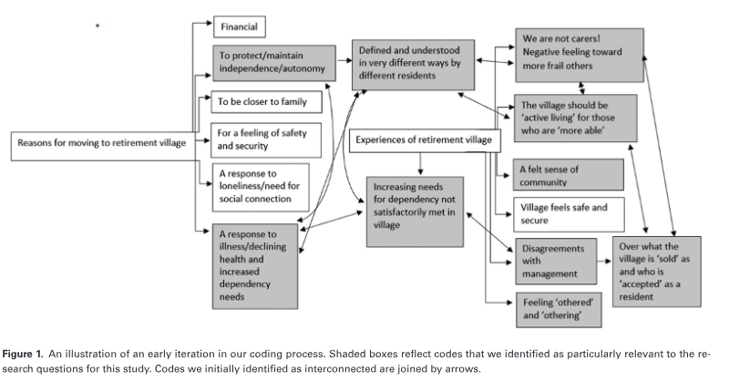
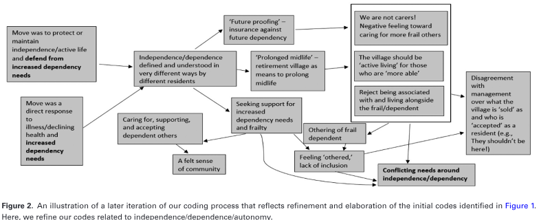

# “We Are Good Neighbors, But We Are Not Carers!”: Lived Experiences of Conflicting (In)dependence Needs in Retirement Villages Across the United Kingdom and Australia

> source: `source_pdfs/Carr & Fang, 2021.pdf`

cite as: Gerontologist , 2022, Vol. XX, No. XX, 1–10
https://doi.org/10.1093/geront/gnab164
Advance Access publication November 3, 2021
© The Author(s) 2021. Published by Oxford University Press on behalf of The Gerontological Society of America.

Research Article

“We Are Good Neighbors, But We Are Not Carers!”:

Lived Experiences of Conflicting (In)dependence Needs

in Retirement Villages Across the United Kingdom and

Australia

Sam Carr , PhD *

,
and Chao Fang , PhD
Department of Education and Centre for Death and Society, University of Bath, Bath, UK.

*Address correspondence to: Sam Carr, PhD, Department of Education and Centre for Death and Society, University of Bath, Claverton Down,

Bath BA2 7AY, UK. E-mail: s.carr@bath.ac.uk
Received: July 14, 2021; Editorial Decision Date: October 27, 2021

Decision Editor: Barbara J. Bowers, PhD, RN, FAAN, FGSA

## Abstract

Background and Objectives: This study sought to qualitatively explore the lived experiences of 80 older people living in
retirement villages across the United Kingdom and Australia. We focused on residents’ narratives around the themes of
independence/dependence.
Research Design and Methods: Qualitative semistructured interviews permitted in-depth exploration of how older people
understood and experienced issues related to independence/dependence in the context of retirement living.
Results: Core themes identified strikingly different and often competing needs and narratives around independence/
dependence. Of note was the fact that narratives and needs around independence/dependence frequently collided and
conflicted, creating a sense of “us” and “them” in the retirement community. The primary source of such conflict was
reflected by the fact that residents seeking a “prolonged midlife” often felt that frailer and more dependent residents were
a burden on them and were not suited to an “independent living community.”
Discussion and Implications: Our findings are discussed in relation to the challenges such competing narratives create for
retirement villages as living environments for a group of people who are far from homogenous.
Keywords: Ageism, Othering, Qualitative, Retirement living

## Introduction: Independent-Living Retirement Villages and Conflicting Needs

It has been estimated that 3% of Australians older than

65 years reside in retirement communities ( Kennedy &
Coates, 2008 ) and between 7% and 17% in the United
States ( Omoto & Aldrich, 2006 ). The number in the
United Kingdom is estimated to be much lower (0.6%),
but there is a growing demand for retirement communi -
ties in the country’s housing market ( Associated Retirement
Community Operators, 2018 ). Glass and Skinner (2013)
have highlighted that little attention has been devoted to
the meaning of terms such as “retirement community,” “re -
tirement village,” or “independent-living retirement com -
munity,” and such labels have been broadly applied to a

variety of housing options for older people.
Kingston et al. (2001) outlined that there are some basic
definitional characteristics that such communities tend
to share: (a) residents who are no longer in full-time em -
ployment, (b) an age-specific population living in the same
bounded geographic area, (c) some degree of collectivity
that may include shared interests, activities, or facilities,
and (d) some sense of autonomy and security. However, be -
yond these basic parameters, retirement communities can
vary considerably in relation to an array of factors such as
This is an Open Access article distributed under the terms of the Creative Commons Attribution License ( https://creativecommons.org/licenses/by/4.0/ ), which permits

unrestricted reuse, distribution, and reproduction in any medium, provided the original work is properly cited.

the provision of assisted living or continued care on-site, a

managed transition from independent living to care-home
facilities, shared mealtimes, and housekeeping and do -
mestic assistance ( Glass & Skinner, 2013 ).
Research has identified various benefits to retirement
living communities for older people, including enhanced so -
cial connection, emotional security, and retention of a phys -
ically active lifestyle ( Jenkins et al., 2002 ; Schwitter, 2020 ).
Downsides have also been identified, including confusion,
depression, and anxiety associated with the transition
from, and sense of loss of valued former lives, particularly
in those who involuntarily move to a retirement commu -
nity ( Bekhet et al., 2009 ). Additionally, division and ten -
sion between residents within retirement communities are
not uncommon ( Shippee, 2012 ). In this study, we focused
on experiences of conflict and tension in relation to the
contrasting needs of residents in “independent-living re -
tirement villages,” purpose-built, geographically bounded
villages for the older than 55 years group, offering on-site
shared leisure activities and facilities, and access to an “in -
dependent lifestyle” (we describe the villages in more depth
in the Method section).
## Contrasting Needs in Retirement Villages

Wiles et al. (2012) argued that “[b]y treating place as a
mere ‘container’ and ‘older people’ as a homogenous cate -
gory, there can be inadequate recognition of diverse needs”
(p. 358). Bekhet et al.’s (2009) exploration of the reasons
older people moved to a retirement community identified a
diverse array of motives labeled “pull” (e.g., the community
was closer to family, offered enhanced security, the prospect
of enhanced activity, or perceived retention of independence)
and “push” (e.g., loneliness, failing health for themselves or
a spouse, needing more help) factors. Furthermore, they
identified that the reasons people chose to relocate were
typically diverse, frequently contrasting and conflicting, and
often reflected a combination of “pull” and “push” factors.
Research has also identified significant diversity in re -
lation to the meaning and experience of independence for
older people ( Bekhet et al., 2009 ; Hillcoat-Nalletamby,
2014 ; Shippee, 2012 ). Hillcoat-Nall é tamby’s (2014) qual -
itative exploration of older people’s understanding and
needs in relation to independence and autonomy across a
range of living settings revealed distinct dimensions such
as executional autonomy (e.g., executing tasks, to varying
degrees, alone and without help), decisional autonomy
(e.g., making decisions about oneself and for oneself), spa -
tial independence (having a private, personal living space),
and social independence (the freedom to socialize or not
and to decide who one socializes with and when). Such dis -
tinct dimensions of autonomy and independence highlight
the diverse ways in which older people may look for and
experience autonomy and independence and reinforce the
argument that autonomy and independence should not be
thought of as unidimensional constructs.
Hillcoat-Nall é tamby (2014) identified that some

individuals wished to,
act as independent, self-sufficient agents, with strong

authorial control over their choices and actions. In this
sense, people explicitly reject support or do not ask
for help, sometimes through fear that accepting it will
signal loss of ability to live independently or because it
evokes a sense of reduced self-determination and con -
trol. (p. 427)
In contrast, others sought to maintain a similar sense of

authorial control over their lives yet preferred to exercise
the choice to request extra-care as deemed necessary, be -
cause they felt able to acknowledge a need for assistance
in certain aspects of their lives. Clearly, what dependence
and independence mean for older people varies and may be
connected to their identity in a broader sense.
Despite being an age-segregated housing model for
older people, retirement villages are home to considerably
diverse residents of a wide age range, experiencing signif -
icantly different health/cognitive challenges, from varied
backgrounds, with different ideas about dependence and/or
independence, and different reasons for moving to a retire -
ment community. Nonetheless, this diverse group of older
people often live alongside each other and are part of the
same “retirement community.”
## The Current Study

The current study draws upon a large qualitative study
of 80 older people residing in independent living retire -
ment villages across the United Kingdom and Australia.
We sought to explore lived experiences of older people
in relation to their motives and needs around indepen -
dence/dependence, and how these motives and needs
aligned or collided with those of other residents. There
is a longstanding debate around “otherness” and the
“othering” of older people in contemporary society
( van Dyk, 2016 ). Jönson (2013) has discussed how such
othering can often be identified by listening carefully to
language and narrative in relation to how older people
are talked about—by themselves and others. Particular
attention was therefore paid to divisions made between
“us” (as a distinct group of residents, with similar values
and/or needs) and “them” (as a separate group, with
competing or conflicting needs) within the villages we
investigated, and how such divisions reflected or shaped
a sense of otherness that was intimately connected to the
meaning of retirement living for older people ( Shippee,
2012 ). It is important for policymakers and developers to
better understand how retirement villages emerge and are
experienced in relation to a diverse range of competing,
contrasting, and conflicting needs and motives. Such un -
derstanding will be of importance in relation to better ac -
commodating, integrating, and understanding the diverse
and/or competing needs of residents within such villages.

## Method

### Sample
A total of 80 interviews were conducted in eight retire -
ment villages across the United Kingdom and Australia.
Four villages were selected from one operating company
in each country, and the selection was based on consulta -
tion with the company and the village senior management
teams. Management teams considered which villages they
felt were most representative in terms of gender, age, and
ethnicity. All these villages were independent-living retire -
ment villages where residents had to be older than 55 years
and have no dependent care needs (although the definition
of dependency was often vague). These villages consisted
of a mixture of houses and flats that could be purchased or
rented. All residents had access to community-based social
activities and were within walking distance of community-
based and often geographically centralized amenities (e.g.,
restaurants, bars/pubs, gyms/pools, libraries, and mainte -
nance offices). While prioritizing independent living, these
villages also offered short-term domiciliary care (e.g.,
cleaning, cooking). Those with long-term care needs (again
loosely defined) would be required to move to more ad -
vanced assisted-living facilities. The village size varied be -
tween 50 and 150 residents at the time of interviews.
The UK sample consisted of 40 participants in the
North-West, South-West, South-East, and Midlands, with
an average residence of 2.8 years. The Australian sample
was collected from 40 participants in a metropolitan
area of Southern Australia, with an average residence of
8 years. All participants were 55 years or older with an
average age of 79 ( SD = 7.6). The oldest participant was
93 and the youngest was 55, and the gender split was 55
women and 25 men. Despite the wide age range, none of
the participants were facing any severe or progressively life-
threatening illnesses at the time of the interview, although a
few had chronic health conditions. Twenty-six people were
married and were living with their spouse, while the re -
maining 54 participants were living alone due to widow(er)
hood, divorce, or unmarried status. More than half of the
participants ( n = 45) had lost loved ones (often a spouse or
partner) in recent years.
Participants were recruited through village managers
who acted as gatekeepers to introduce the research pro -
ject and researchers to the residents. The support of the
village managers fostered a clear sense of trust between
participants and the researchers that persisted through
the research process. With this rapport, the interviewers
aimed to be “a safe, interested stranger,” with whom the
participants felt at ease to share their often painful and pre -
viously unspoken life experiences ( Johnson, 2013 , p. 182).
Residents were informed by village managers that the study
sought to talk deeply to older people about their inner
emotional lives, feelings of connection and disconnection,
relationships, life history, and lived experiences of retire -
ment living. Residents then contacted village managers if
they felt that they wished to take part. Subsequently, a team
of four trained researchers (including the authors) in the

United Kingdom and four trained researchers in Australia
contacted these residents by telephone.
The study was approved by the Research Ethics
Committee at the authors’ institution. Ethical approval was
also granted according to the internal processes in place
for the management teams of villages in both the United
Kingdom and Australia. Furthermore, permission was also
gained from the local site managers at each of the eight
participating villages.
### Interviews

All interviews were conducted in the participants’ homes
independently by the eight researchers between October
2019 and February 2020 in the United Kingdom and
Australia. Interviews ranged from 70 to 200 min in length
and averaged around 100 min. Participants were alone
with the interviewer for all interviews. Where a spouse
or partner was at home at the time of the interview, they
were not present in the room. The project generated ap -
proximately 8,000 min of in-depth data that were audio-
recorded and professionally transcribed.
The data presented in this article were part of a broader
in-depth qualitative listening exercise. Our objective with
the interviews was to allow participants the time and space
to talk freely about their thoughts and feelings in relation
to a number of key areas: (a) their lives up to this point
(including childhood, adolescence, career, family, and any -
thing else they wished to share and discuss), (b) their closest
relationships, (c) experiences of loss, (d) feelings of loneli -
ness and isolation, (e) their decision to move to retirement
living, and (f) their lived experiences of the retirement com -
munity. Each of these areas was broad, complex, overlapped
with other areas, and opened-up numerous avenues of dis -
cussion that were personal and unique to the person con -
cerned and their lived experiences. It should be noted that
this article deals specifically with older people’s decision to
move to retirement villages and their lived experiences of
these villages. However, this is not to say that other parts of
the interview/s were not relevant or important in relation to
this focus—so all parts of the full interview formed a part
of our analysis. We adopted an approach to our interviews
( Kvale & Brinkmann, 2009 ; Morgan & Burholt, 2020 )
that enabled participants to construct their stories around
the core areas of the interview schedule. Participants could
talk as freely as they wished, and interviewers were trained
to listen and to interrupt minimally. Several participants
commented on the value of the interview for them—it pro -
vided a welcome and (often) rare space for them to open up
and feel genuinely “listened to.”
### Data Analysis

A thematic analysis ( Braun & Clarke, 2012 ) was conducted
to interpret these rich data and an inductive approach was

adopted. This method of analysis allowed for important

messages about lived experiences and nuanced feelings in
relation to retirement community living to emerge from a
large amount of data, without being dominated by preex -
isting frameworks ( Mason, 2002 ). In so doing, a rich un -
derstanding of how participants experienced retirement
community living in relation to core issues such as indepen -
dence, dependence, and division arose from the analysis.
The analysis was conducted by both authors, who read
the interview transcripts and notes thoroughly before
conducting independent coding of each interview transcript.
A combination of NVivo 12, a qualitative analysis soft -
ware package, and more traditional Microsoft Word-based
reading and coding was used to manage and analyze the
large data set. We followed the six-phase thematic analysis
process recommended by Braun and Clarke (2012) , which
involved familiarizing ourselves with the data, generating
initial codes, searching for themes, reviewing and discussing
potential themes, refining and naming themes, and writing
themes up. The two authors met frequently to discuss and
compare findings and codes. If there was disagreement or
divergence on codes, further reading and discussion were
conducted until a consensus was met. Upon the completion
of coding, final codes were converted to a diagrammatic
representation. Figures 1 and 2 display an early and later
iteration of our coding processes in diagram form.
## Findings

Approximately 15% ( n = 12) of interviewees (the
“prompted by dependency group”) revealed that they had
made the decision to move to a retirement community for
more concentrated social and practical support following
an experience that brought about an increased sense of
dependency for either them or their spouse. This typically

involved either the loss of a spouse and/or significant phys -
ical or cognitive health deterioration for themselves or their
spouse that prompted them to seek a more assistive, se -
cure, and supportive living environment. In contrast, 50%
( n = 40) of interviewees (the “predependency group”) told
us that they had made the move to retirement living before
experiencing any sort of significant loss or increase in de -
pendency whatsoever. Typically, people in this group told
us that their main motivation for moving to the retirement
community was to access social interactions and purpose-
designed facilities that can help them either to (a) facilitate
“active living” as they aged and/or (b) to ensure they would
be ready and prepared for increased dependency in the fu -
ture. Finally, approximately 35% ( n = 28) of interviewees
(the “became-more-dependent-in-place group”) revealed
that they had initially moved to the retirement community
for the same reasons as the “predependent” group but had
experienced increasing dependency needs at some point
since moving.
It was surprising to see the diverse and often
competing needs of these participants regardless
of them living in largely similar independent-living
villages. While acknowledging that these self-selected
participants’ accounts were potentially biased due to
their special conditions and needs, we were able to use
their unique perspectives to capture their diverse phys -
ical, cognitive, relational, social, and emotional needs
and experiences. These include the varied ways they
experienced and relied upon the retirement commu -
nity; the need for independence was interpreted and
negotiated by these residents in strikingly different and
frequently competing manners. We present our findings
in relation to this issue according to some primary
Figure 1. An illustration of an early iteration in our coding process. Shaded boxes reflect codes that we identified as particularly relevant to the re -

search questions for this study. Codes we initially identified as interconnected are joined by arrows.

themes: (a) remaining “independent and active,” (b)

coping with increasing dependency needs, (c) conflicting
needs around independence and dependence, and (d)
developing a sense of community ( Figure 1 ). Themes 1
and 2 provide the background of the diverse groups of
residents with different needs and expectations. Theme
3 highlights the primary findings of this study on the sig -
nificant differences and conflicts in relation to these di -
verse older people’s desires from their retirement living.
Theme 4 reveals the importance of “aging together” as a
means of alleviating conflict within the villages. To pro -
tect participants’ confidentiality, pseudonyms are used
throughout.
### Remaining Independent and Active

### Prolonging midlife
The retirement villages in our study were often branded
by the organizations that developed and managed them as
“older than 55 years active independent living” villages.
For many participants (about 25%), typically those from
the predependency group described above, comparatively
younger, newly moved (within the last 2 years), and who
still considered themselves to be “physically active,” the
move to a retirement community was designed to help
maintain a feeling of independence and “active living” and
essentially to prolong midlife.
So, then this decision to move. So, then I thought okay,

how can I be independent? So rather than just going
to another retirement home …. Although it was an in -
dependent flat the set-up was a lounge with the chairs
all around [laughs]. I’m thinking, forget it [laughs]. And
I appreciate I’m a young 64-year-old and so I decided
this concept of village, what does it mean, to keep me
connected, not become isolated on my own. But also
leave me my independence. I’m very interested in the
environment and stuff like that. (Lucy, 64, UK)
Even for those (10%) like Steve who was relatively older,

retirement living was seen as a means of maximizing a
healthy and fun lifestyle.
Well, if I was 30 again, I’d still be playing squash and

tennis and I’d be running and doing all these things, but
you’re not, so you can’t do that. Yes, I think we should
set out to live life to the full and a place like this gives
you the opportunity to continue to do that in your more
mature years. (Steve, 81, UK)
### Future proofing

This prolongation of midlife was often accompanied by
an awareness that increasing dependency may be a future
challenge, for which many people (30%), exclusively from
the predependency group, wanted to feel “prepared” and
“ready” but that was not yet a reality. David had moved
to the retirement community with his wife 3 years ago and
clearly articulated this position:
I think we are very fortunate. We are still reasonably

fit. We’ve got a strong stable background of family and
friends. This is a place which hopefully will be easy
to live and do the things we want to and keep fit and
healthy.
We only wanted to move once. So, you want to be some -
where where you’re both comfortable and ready for the
future, that was certainly part of it, yes. (David, 76, UK)
Paula had moved to the retirement village within the last

year. She expressed similar sentiments.
As a widow. Yes. It’s a kind of “future proofing” exercise

because you have got the buses when you can’t drive
anymore, you can get out to get your shopping easily,
you are not going to be marooned, plus there’s all these
facilities … and if you want to go out to play, they’ve
got something going on every day, all day long [laughs]!
(Paula, 72, UK)
Figure 2. An illustration of a later iteration of our coding process that reflects refinement and elaboration of the initial codes identified in Figure 1 .

Here, we refine our codes related to independence/dependence/autonomy.

Roger had moved to the village with his wife, Margaret,

and told us that the village reflected a sort of safety mech -
anism designed to alleviate future loss and dependency.
That’s another potential reason for moving somewhere

like this, possibly sooner than you really need to, be -
cause if Margaret did die before me, in the future, there
are a lot of people I know around here. I wouldn’t be
particularly lonely. I would miss Margaret a hell of a lot,
but I could exist, survive. (Roger, 73, UK)
### Rejecting being associated with the “old” and “dependent”
In some residents (15%), from the predependency group,
the desire to hold on to active, independent living was also
accompanied by a rejection of the stereotypical idea of re -
tirement villages and a differentiation between themselves
and concepts related to “frailty,” “dependency,” or “being
old.” Polly expressed a desire to distance herself and the
community she lived in with what she felt was a negative
stereotype of a retirement community:
I saw the look of horror on people’s face when you say

where you are going to is a retirement village. You are
consigning yourself to the rubbish tip, being put in a
corner to rot. Those places I saw when I was looking
for my mother, which smelt of cabbage and urine, and
people were in chairs in a canteen to eat food which was
overcooked and under-loved, the way that there was no -
where for them to sit except in a circle with the televi -
sion blaring—that is absolutely NOT what this [village]
is. (Polly, 73, UK)
Some predependent residents (10%), like Jane, however,

also expressed objections against being surrounded by
“older” people.
The older people make you feel older. Yes. They can’t do

as much …. We do help them, but we can’t be living our
life around them. (Jane, 72, UK)
### Coping With Increasing Dependency Needs

A smaller subset (15%) of people was prompted to move
into retirement villages by direct experiences of increasing
dependency needs, typically related to their health or be -
reavement. They thus had direct intentions to find both so -
cial and practical support from the retirement community
to better cope with these challenges while maintaining in -
dependence to some extent. Peter had recently moved into
a UK retirement community with his wife, Sue. The couple
had increasingly been struggling with Sue’s deteriorating
dementia and viewed the village as a solution to some of
the challenges they faced.
Well, it all stems really from Sue’s illness … the problems

that have occurred, and we thought this [village] would
be the answer …. I was under the impression that’s what

we would find by moving here. (Peter, 78, UK)
Patricia sought to restore a sense of independence by

moving to the retirement community following a major hip
operation that left her debilitated and feeling increasingly
isolated.
I thought, this won’t do at all. I am an independent

person. I do not like this, being trapped like this … it
seemed to me that it was time I was thinking about
finding somewhere like this [village] to move to—be -
cause another winter like that and I would have got
so depressed I would probably have done myself in.
(Patricia, 85, UK)
Furthermore, for some residents (10%), moving into re -

tirement villages had not only helped them to cope with
increasing dependency needs but had also contributed to
restoring a sense of safety, security, and autonomy. Meg
told us:
I feel as though with this organisation [village provider],

I feel cared for. I feel safe and cared for and for me,
that’s enough—to feel safe and cared for, right. The rest
is up to me now and I’m doing the best I can. (Meg, 84,
Australia)
### Conflicting Needs Within the Village

### “We are not carers!”
Perhaps the most powerful theme to emerge from our data
set (in the sense that it reflected how the above needs of the
different groups were interrelated and experienced in rela -
tion to others in the community setting) was a conflict in re -
lation to how people with different needs and ideas around
independence and/or dependence experienced “othering”
when living alongside each other in retirement villages
( Shippee, 2012 ). Frequently, those who formed part of the
“predependency group” (30%) felt challenged by, resentful
of, or objected to the presence of other residents who were
more frail, dependent, or older.
I mean, the average age here is nearly 80. That’s not “ac -

tive retired,” is it? Somebody moved in who was 94?!
(Ralph, 72, UK)
No, because they shouldn’t be here! They should
go into a care home. We’re not carers! We’re not a
care home! This is for over 55s, actives, active living.
Now, people if they buy down here and they’re in
a wheelchair, it’s up to them, they’ve got to work
it out, how to get to the club house. So, you’ve got
to be active, otherwise there’s a care home for you.
(Margaret, 78, UK)
I don’t think the people [here] are vetted enough. I think
the main criteria is you’ve got the money. I don’t neces -
sarily think there ought to be MORE support—I think

there ought to be LESS people who require support here.

(Paul, 74, UK)
Some people (15%) made reference to the fact that they felt

the presence of older and more frail residents contradicted
what they had been “sold” when they moved to the
community.
This is advertised as independent living for the active

over 55-year-olds. That’s the advert, you will see that …
so whereas the average age here might have been 75, it’s
now over 80, and we feel that we are in an “old people’s
home” rather than “active, independent living” …. And
we are not the only people, we’ve had a lot of arguments
with [management company] about this. (Roy, 72, UK)
We don’t want to be tripping over Zimmer frames the
whole time and it’s a bit depressing in a way to see these
people who really ought to be in a nursing home or in
care. (John, 73, UK)
Some (10%) objected to the burden of satisfying “care

responsibilities” to help those more dependent and
frailer.
We’ve had to tell them we are good neighbours, we are

not carers. I’m not here to be a carer. We didn’t sign
up to look after people, we signed up to have an inde -
pendent life. We want to be in a community of people
who are active and independent. We don’t want to have
people who depend upon us for their daily lives. (Roy,
72, UK)
### The other side of the coin

The smaller percentage of residents in the “prompted
by dependency group” (10%), who had moved in to
seek support and assistance for increased dependency
needs, articulated lived experiences of being “othered”
in the community that often reflected a sense of iso -
lation and exclusion ( van Dyk, 2016 ). As mentioned
above, Peter and his wife, Sue, had moved into their
retirement community on the understanding that it
would provide them with a sense of support and as -
sistance as Sue’s dementia became increasingly chal -
lenging for them.
Well, she’s tried the book club here and she gets so …

how best describe it? Frustrated, because she can’t com -
plete a sentence, frustrated, because she hasn’t been able
to read the books because the font size is too small, she
has to have a relatively large font size to be able to read,
it has to be a light-ish book because otherwise it’s too
heavy for her … and so on.
But my point is they don’t really take it on board in the
group and provide the support I think she needs. And,
in some ways, now, I just feel she’s a bit like a leper re -
ally—because no one actually wants to get close to her
here. (Peter, 78, UK)
Fundamental to such exclusion was a perceived lack of un -

derstanding (from other residents and management/staff)
of the “prompted by dependency group” residents’ needs
in the community.
We’ve been disappointed in that sense. The care isn’t

there that we thought was going to be there. I don’t
think people here understand what dementia is all
about. (Peter, 78, UK)
### Developing a Sense of Community

Despite the conflict of needs and the division captured
above, some residents (35%) clearly articulated a sense
of community and placed value on both supporting those
more vulnerable than themselves and on being supported
by other residents. When continuing to live in a commu -
nity where dependency and frailty increasingly become
norms, residents (15%) like Milly seemed to value and
genuinely take pride in supporting and providing for other
members of the retirement village and clearly played a role
in fostering and enhancing a sense of care and community.
When my late husband, Doug, lived here [in the village]

too, he got very, very involved. Anybody around the
place that had a problem, Doug would fix it. Sometimes
I’d think, “Where is he? I wish he would come in and
have his lunch.” He’d be somewhere talking to some -
body or fixing something for somebody!
He [Doug] said, “I wonder what they are doing for the
turn of the century.” I said, “I don’t know.” Doug said,
“Well we are going to have a barbecue,” so we started
it. Anyway, I don’t know how many people we had but
it was chockers, everybody came … it was beautiful. So,
we started doing it in the village every month, a bar -
becue, and we did it for 10 years! (Milly, 88, Australia)
We found that such a sense of community was closely

connected to the lived experience and expectations re -
garding growing older together . The significance of sharing
lives and nurturing relationships in everyday community
living was clearly evidenced in the United Kingdom and
Australian villages, but sometimes in distinctive ways. In
the UK villages, the residents had lived in their villages on
average for less than 3 years. While admitting a sense of
community was yet to be fostered, they (15%) believed that
aging in the community was key to nurture intimacy and
belongingness as a means of defending from impending
aging-related challenges.
At the moment, living here, we are more the other side of

things, we are more the people that the neighbours say,
“Can you help with this or do that?” “Take me some -
where or do that.” But I think it would work the other
way round. I think maybe if we both get older and more
connected here we would possibly become dependent
on very close friends here. (Ralph, 72, UK)

On the other hand, the residents (20%) in Australia had a

significantly longer time aging together with others in the
villages for an average of 8 years; a few (10%) like Milly,
88, had even lived in their community for over 15 years.
As such, an ongoing sense of care and community was
captured either within a small group or by a community
as a whole.
Emma: In the area where we lived [pre-retirement com -

munity] … we didn’t know so many people around us …
but here [in the village] I can say I know everybody here.
Interviewer: Does it feel like a community?
Emma: Yes, it does. Yes. (Emma, 87, Australia)
## Discussion

In line with Wiles et al.’s (2012) argument, we took the
position that older people living in retirement villages are
a far from homogeneous group and likely have diverse and
often contrasting ideas about what they need and hope
to find in relation to independence, dependence, and au -
tonomy ( Hillcoat-Nall é tamby, 2014 ). Our data revealed
significant and meaningful differences in relation to what
older people may be seeking in relation to independence
and dependence when they choose to move to a retirement
community. A significant group of participants reflected
a typically younger subset, living in a “predependency”
phase, yet to experience serious decline in health or signifi -
cant increases in physical, social, or emotional dependency.
Such participants clearly viewed the retirement community
as a space in which they sought to retain a sense of “ac -
tive living,” where they could feel fully independent, active,
and “prolong midlife” ( McHugh, 2000 ). They expressed a
feeling of security in the idea that the retirement commu -
nity offered them a “future proofing” against increased de -
pendency or loss as they aged.
In contrast, a smaller subset of participants had clearly
been “prompted” by increased dependency needs to move
to a retirement community and articulated very different
needs and ideas around dependence and independence. For
such residents, the retirement community reflected a space
where they hoped that their increased dependency needs
(which could relate to physical or cognitive health decline,
disability, or social and emotional deficits) would be un -
derstood, accepted, and supported, so that they might re -
tain and protect relative independence and autonomy in the
face of significant aging-related challenges.
To some extent, this variation in needs and narratives
around independence and dependence may reflect the lack
of consensus around what retirement villages are (and are
not), raised earlier in the article ( Glass & Skinner, 2013 ).
In our study, older people with very different ideas of what
independence/dependence meant (for them), identified,
bought into, and were sold different promises about the
same villages. Beyond the basic parameters of being retired,
having geographic boundaries, offering shared activities
and facilities, and a sense of “autonomy” and “security”

(however defined), the retirement villages in our study fre -
quently offered different (and sometimes incompatible)
narratives and meanings to different people.
Our data clearly revealed narratives around “same -
ness” (us) and “difference” (them) that were tied to the
degree of independence and/or dependence older people
embodied. Jönson (2013) has discussed how the otherness
of older people is revealed in language that signifies “dif -
ference,” “comparison,” and “categorization” and is used
by members of in-groups to discriminate against members
of “out-groups.” In our study, there was a clear use of lan -
guage connected to extreme old age (“the average age
here is nearly 80. That’s not active retired, is it? Somebody
moved in who was 94?!”) and a need for care and depend -
ency and/or deteriorating capabilities (“We don’t want to
be tripping over Zimmer frames the whole time … it’s a bit
depressing in a way to see these people who really ought
to be in a nursing home”) that created a sense of “us” (the
active, independent residents) and “them” (the old, frail,
needy, and dependent residents) in the retirement villages.
The construction of such otherness around themes of
dependency and independence within retirement villages is
potentially problematic for several reasons. First, it risks
creating a clear sense of feeling discriminated against or
excluded in members of the outgroup (e.g., “I just feel she’s
a bit like a leper really—because no one actually wants to
get close to her here”). Second, perhaps retirement villages
cannot be “all things to all people.” It is, for example, con -
tradictory to suggest that villages can fully support, ac -
cept, include, and accommodate older people who move
in with significant dependency needs, while simultaneously
providing an environment that satisfies the wishes of those
who might prefer to live in a community that embodies
“active independence” or “prolonged midlife.” Third, as
Jönson (2013) argued, there is a paradox in the othering
of more frail, vulnerable, and dependent older people that
may be irrational because “according to all human experi -
ence, we inevitably have to face it …. Some kind of misun -
derstanding must be the cause: why else would we want to
dispose of a percentage of the population that we will be
part of in the future?” (p. 199).
It is important for developers and providers of retire -
ment villages to recognize their role in constructing conflicts
and collision in relation to narratives of independence and
dependence for older people. Ageism may be amplified by
retirement villages that strongly promote an image of “ac -
tive independent living.” McHugh (2000) has argued that
the “ageless self” and the “prolongation of midlife” have
become “the leitmotif of contemporary society, conveying
little about change and what it really means to grow old”
(p. 103). He further argued that such ageist attitudes and
societal values are firmly embedded in the identities of cer -
tain retirement villages and, thus, such villages play a role
in “selling” and subsequently “reinforcing” an unrealistic
and potentially discriminatory idea of growing old.

Our data also raised the ethical issue of retirement

villages “selling different ideals to different people.” The
tensions this created when such residents lived alongside
each other were clear to see in our data set, and careful con -
sideration is required in relation to what older people are
“sold” when they move to a retirement community.
It should be noted that some residents deeply valued
supporting those more dependent than themselves,
contributing to a sense of inclusivity within the community.
These residents actively sought bonds and solidarity with
other residents, aiming to cope with aging in a more com -
munal manner. Lawrence and Schigelone (2002) have raised
the possibility that age-related stressors often thought of as
“individual” in nature can be shared, expressed, and coped
with “communally.” It is possible that retirement villages
offer the prospect of communally coping with increased
dependency and vulnerability associated with aging. In
our study, this was particularly clearly demonstrated
among some Australian residents who had lived together
for a considerable time. Although the duration of time
in a place is not the only determinant, the experiences of
growing older together, over time, could significantly shape
residents’ experiences of aging and increased dependency in
a positive manner.
Some older people in our study, who were part of the
“predependency” group, implicitly understood that those
in the “prompted-by-dependency” or “became-more-
dependent-in-place” groups may well be a reflection of
their future selves and, as such, they were more able to
accept and acknowledge these older people as part of the
community. Given the unrealistic ideal of an eternal midlife
and the fact that people with higher dependency needs are
simply further along a pathway that most will (in different
ways) likely follow at some point in their lives, it makes
sense for retirement villages to devote time and resources
to creating a community where, rather than “othering,”
people seek to better understand, support, and include
others who may simply be embodiments of their future
selves ( Jönson, 2013 ).
In conclusion, McHugh (2000) has argued that retire -
ment communities reflect “societal scripts in successful
aging … defined as much by the absent image—old, poor
folks … as by the image presented: handsome, healthy,
comfortably middle-class ‘seniors’, busily filling sun-
filled days” (p. 113). As Laws (1995) suggested over
25 years ago, the project for future retirement villages
will necessarily involve moving beyond retirement
communities that simply reinforce this script. Our data
also raise questions already outlined in the literature
( Glass & Skinner, 2013 ; Wiles et al., 2012 ) related to
whether communities designed for “older people” as a
homogeneous category are a desirable model if they (a)
inadequately recognize the diverse and conflicting needs
of an extremely wide range of people and (b) are often
so vaguely defined that they appear to offer “all things
to all people.”
## Funding

This project was supported by a research grant RE-ED1100 from
Guild Living Ltd . The authors confirm that the funder played no
role in the design, execution, analysis, and interpretation of data, or
writing of the study.
## Conflict of Interest

None declared.
## Statement of Ethical Approval

This study was approved by the Social Sciences Research Ethics
Committee (SSREC) at the University of Bath (SSREC reference
S19-052).
## Acknowledgments

We would like to acknowledge the following people and organ -
izations for their kind support of this project: (a) Prof. Malcolm
Johnson, (b) Guild Living, (c) Dr. Kate Barnett, (d) the research
teams in the United Kingdom and Australia, (e) Life Care, Australia,
(f) Inspired Villages Group, UK, and (g) the participants who kindly
shared their thoughts, feelings, and experiences with us.
## Author Contributions

Both authors made a substantial contribution to (a) the conception
and design and analysis and interpretation of data, (b) the drafting
of all sections of the article, and (c) approval of the final version to
be submitted for publication.
## References

Associated Retirement Community Operators. (2018). Retirement
communities fact pack. https://www.arcouk.org/resource/
retirement-communities-fact-pack
Bekhet, A. K., Zauszniewski, J. A., & Nakhla, W. E. (2009).
Reasons for relocation to retirement communities: A qualitative
study. Western Journal of Nursing Research , 31 (4), 462–479.
doi: 10.1177/0193945909332009
Braun, V., & Clarke, V. (2012). Thematic analysis. In H. Cooper,
P. M. Camic, D. L. Long, A. T. Panter, D. Rindskopf, & K. J. Sher
(Eds.), APA handbook of research methods in psychology, Vol.
2. Research designs: Quantitative, qualitative, neuropsycho -
logical, and biological (pp. 57–71). American Psychological
Association.
Glass, A. P., & Skinner, J. (2013). Retirement communities: We know
what they are … or do we?. Journal of Housing for the Elderly ,
27 (1–2), 61–88. doi: 10.1080/02763893.2012.754815
Hillcoat-Nall é tamby, S. (2014). The meaning of “independence”
for older people in different residential settings. The Journals
of Gerontology, Series B: Psychological Sciences and Social
Sciences , 69 (3), 419–430. doi: 10.1093/geronb/gbu008
Jenkins, K., Pienta, A. & Horgas, A. (2002). Activity and health-related
quality of life in continuing care retirement communities. Research
on Aging , 24 (1), 124–149. doi: 10.1177/0164027503024001008

Johnson, M. (2013). Biography and generation: Spirituality and bio -

graphical pain at the end of life in old age. In R. Silverstein (Ed.),
Kinship and cohort in an aging society: From generation to gen -
eration (pp. 176–190). John Hopkins University Press.
Jönson, H. (2013). We will be different! Ageism and the temporal
construction of old age. The Gerontologist , 53 (2), 198–204.
doi: 10.1093/geront/gns066
Kennedy, D. & Coates, D. (2008). Retirement village res -
ident satisfaction in Australia: A qualitative enquiry.
Journal of Housing for the Elderly , 22 (4), 311–334.
doi: 10.1080/02763890802458403
Kingston, P., Bernard, M., Biggs, S., & Nettleton, H. (2001).
Assessing the health impact of age-specific housing.
Health & Social Care in the Community , 9 (4), 228–234.
doi: 10.1046/j.1365-2524.2001.00298.x
Kvale, S. & Brinkmann, S. (2009). Interviews: Learning the craft of
qualitative research interviewing . Sage.
Lawrence, A. & Schigelone, A. (2002). Reciprocity beyond dyadic
relationships: Aging related communal coping. Research on
Aging , 24 , 684–704. doi: 10.1177/016402702237187
Laws, G. (1995). Embodiment and emplacement: Identities, repre -
sentation and landscape in Sun City retirement communities.
International Journal of Aging & Human Development , 40 (4),
253–280. doi: 10.2190/BR6H-GQGF-RDN8-XA31
Mason, J. (2002). Qualitative researching . Sage.

McHugh, K. (2000). The “ageless self”? Emplacement of identities
in sun belt retirement communities. Journal of Aging Studies ,
14 (1), 103–115. doi: 10.1016/S0890-4065(00)80018-3
Morgan, D. & Burholt, V. (2020). Transitions in loneliness in later
life: The role of social comparisons and coping strategies. Ageing
and Society , 1–22. doi: 10.1017/S0144686X20001634
Omoto, A. & Aldrich, C. (2006). Retirement commu -
nity life: Issues, challenges, and opportunities. Annual
Review of Gerontology and Geriatrics , 26 (1), 283–303.
doi: 10.1891/0198-8794.26.1.283
Schwitter, N. (2020). Social capital in retirement villages: A lit -
erature review. Aging and Society , 1–29. doi: 10.1017/
S0144686X20001610
Shippee, T. (2012). On the edge: Balancing health, participation, and
autonomy to maintain active independent living in two retire -
ment facilities. Journal of Aging Studies , 26 , 1–15. doi: 10.1016/j.
jaging.2011.05.002
van Dyk, S. (2016). The othering of old age: Insights from post -
colonial studies. Journal of Aging Studies , 39 , 109–120.
doi: 10.1016/j.jaging.2016.06.005
Wiles, J. L., Leibing, A., Guberman, N., Reeve, J., & Allen, R. E.
(2012). The meaning of “aging in place” to older people. The
Gerontologist , 52 (3), 357–366. doi: 10.1093/geront/gnr098

